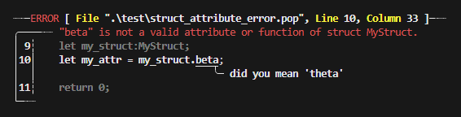

# **Intersect**

A functional yet unfinished compiled language that is **explicit and versatile**.

***IMPORTANT***
> This project has been discontinued.  I had started this project as an experiment to see if I could make a compiler from (mostly) complete scratch in python.  Turns out python is a much nicer compiler development language than I initially thought it would be.  While I did not complete all of my overambitious plans for the compiler, what was completed is mostly functional. All integration tests are passing, except for the hash map test.  I believe this test started failing with the introduction of virtual functions.  By the time I had finished getting virtual functions functional I was so burnt out on my overly ambitious scope that I slowly abandoned the project (I have since learned from my overly ambitious approach to these kinds of projects and have produced much more complete software and libraries since then).  Feel free to clone and try out the compiler,  I cant promise there wont be any bugs, but from my testing it should work for simple-ish test applications.  This project was a great learning experience in both project and scope management.

## How it works

**Intersect** compiles utilizing the *LLVMLite* python module by *Numba*.  It utilizes a complex concrete syntax tree to handle it's compile time mechanisms such as it's garbage collector, minimal function/struct emmitter and mangler, automatic typing, and much more.

## Language Conventions and Features

### Comments

**Intersect** uses cPython style comments:

```py
# This is a comment.
```

For multiline comments use:

```py
#:
    This is a multiline/closed comment.
:#
```

### Keywords

In **Intersect**, keywords are explicitly named.  Ex:

```rust
struct StructName<TemplateType> {

    attribute:TemplateType;

    operator == (self:$StructName<TemplateType>, other:$StructName<TemplateType>) {
        return self.attribute == self.attribute;
    }
}
```

### Robust Compile Time Errors

Source Code:

```rust
struct MyStruct {
    data:i32;
    theta:i32;
    func meta(self:$MyStruct, arg:i32) {
        return;
    }
}
func main() ~> i32{
    let my_struct:MyStruct;
    let my_attr = my_struct.beta;
    return 0;
}
```

Output:



Compile time error feedback provides you with a detailed annotated view of the error in your source code.

### Operator Macros (Work in progress)

Operator macros let you implement extra operators with explicit names for classes.  This allows for a more declarative syntax.

```rust
macro operator binary equals;

struct StructName<TemplateType> {

    data:TemplateType;

    operator equals (self:$StructName<TemplateType>, other:$StructName<TemplateType>) ~> bool {
        return self.data == self.data;
    }
}

func main() {
    let s1:StructName<i32>;
    let s2:StructName<i32>;
    s1.data = 1;
    s2.data = 1;

    libc_printf("equal operator result %i\n":$c8, s1 equals s2);
    return;
}
```

### Automatic Memory Management (Work in progress)

**Intersect**'s automatic memory allocation is confined to scope.  `manage` prefixes a *type* as a managed heap allocated type.  `allocate` then returns an instance of something equivalent to this struct:

```rust
macro operator unary clone;

struct HeapMemory<Type>{
    data:$Type;
    has_data:bool;

    operator delete (self:$HeapMemory<Type>) {
        if self.points_to_memory {
            free?<Type>(self.data);
        }
        return;
    }

    operator clone (self:$HeapMemory<Type>) ~> $HeapMemory<Type> {
        # clone self.data
        return #: Clone of self.data :#;
    }

    operator = (self:$HeapMemory<Type>, rhs:$HeapMemory<Type>) ~> $HeapMemory<Type> {
        if self.points_to_memory {
            free?<Type>(self.data);
        }
        # point to new heap memory
        return &self;
    }
}
```

When heap memory is returned from a function, it passes ownership to its caller:

```rust
func ret_heap_memory() ~> manage $i32 {
    return allocate 1; #allocate creates an instance of a heap wrapper which frees all elements on destruction.
}

func main() {
    let item:manage $i32;
    item = ret_heap_memory();
    # Here!!!
    return 0;
}
```

This means that the `HeapMemory_instance.has_data` is set to `true`.

## Updates

### First Ever Intersect Program Compiled!

The first ever **Intersect** program was compiled today on `Saturday, November 18, 2023 at 8:20 P.M.`.  It doesnt do much, but it is *something!*

```rust
# test.pop

struct Vector<ItemType> {
    data:[ItemType x 5];
}

export func test(num: i32) {
    let my_vec:Vector<i32>;
    
    return;
}
```

Heres the *LLVM-IR* generated by compiling this program.

```llvm
; ModuleID = "./test.pop"
target triple = "unknown-unknown-unknown"
target datalayout = ""

%"Vector_struct_tmp_MMAANNGGLLEE_i32" = type {[5 x i32]}
declare i32 @"printf"(i8* %".1", ...)

declare i8* @"malloc"(i64 %".1")

declare i8* @"realloc"(i8* %".1", i64 %".2")

declare void @"free"(i8* %".1")

@"null" = global i8 0
define void @"test"(i32 %"num")
{
entry:
  %"my_vec" = alloca %"Vector_struct_tmp_MMAANNGGLLEE_i32"
  ; OP::define(stack) START
  ; OP::define(stack) END
  ; OP::return START
  ret void
  ; OP::return END
}
```

## TODO

### Refactor member function namespace/name mangling to all be within the module class.

Or figure out a way to make current solution work.

### Implement Algorithm for Building Order Of Operations Trees:

See description of algorithm in file:

`llvmcompiler/tree_builder/build_tree/operations_parser.py`

### Implement Struct Operators (Not started yet):

 - Operator functions will be prefixed with the `OPERATOR` keyword rather than `func`

 - Destructor operator to decide how to handle memory when out of scope

    All heap allocated values are collected by default.

```rust
struct StructName {
    OPERATOR destructor(self) {
        delete self.heap_allocated_attribute;
    }
}
```

### Major Rework of Garbage Collector And How Heap is Allocated (Work In Progress):

```py
{
    let test_md_array: [$[i32]] persist = [
        heap [0,1,2],
        heap [0,1,2],
        heap [0,1,2],
        heap [0,1,2],
        heap [0,1,2]
    ];


    # test_md_array's heap allocated members are freed here at the end of its scope if persist is not used.
    # all heap values become null
}
```

The heap keyword should prefix values instead of variables.  This means that the garbage collector will need to free those values once the memory goes out of scope.

### Implement Float Types For Operators (Not started yet)
